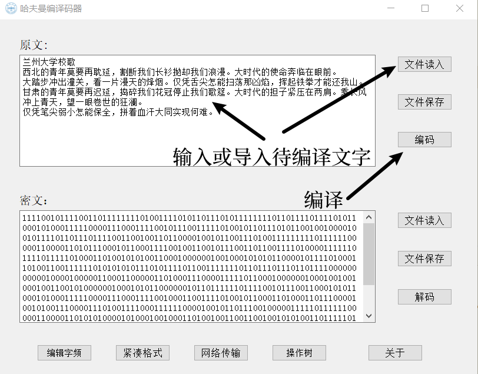
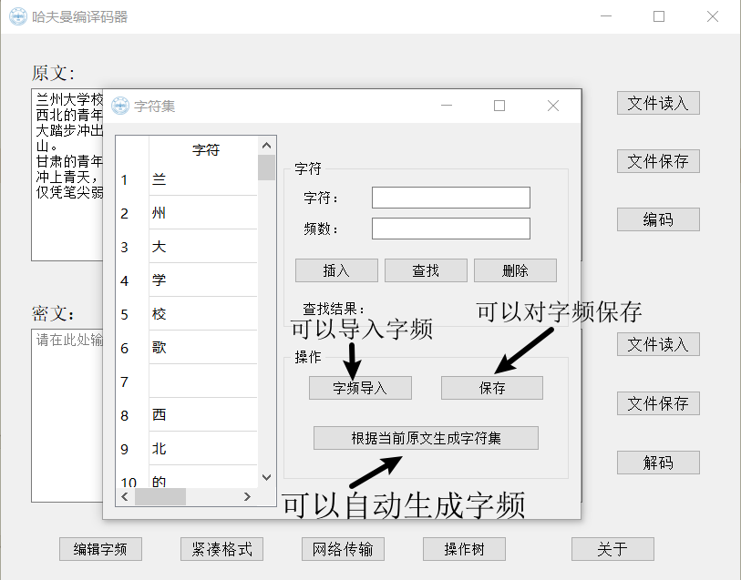
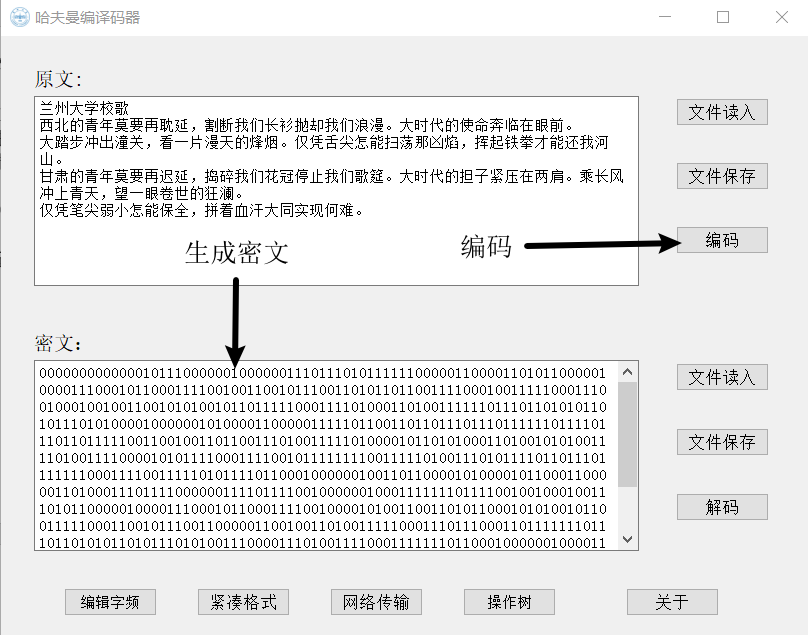
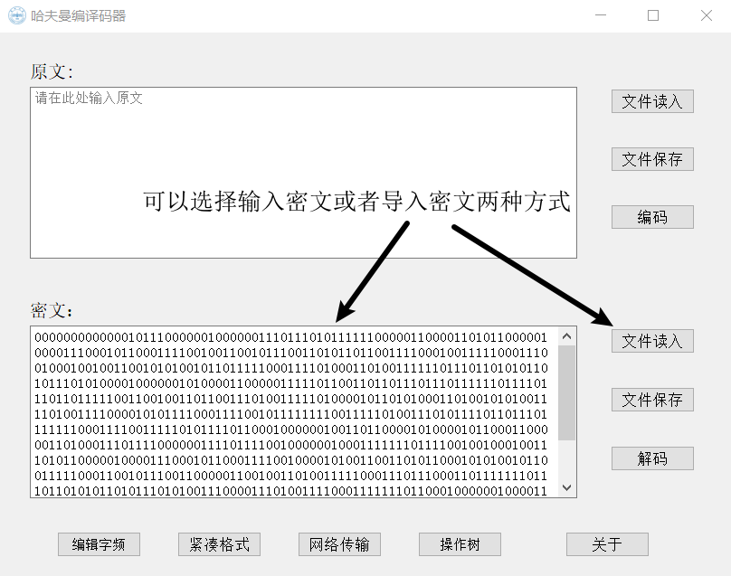
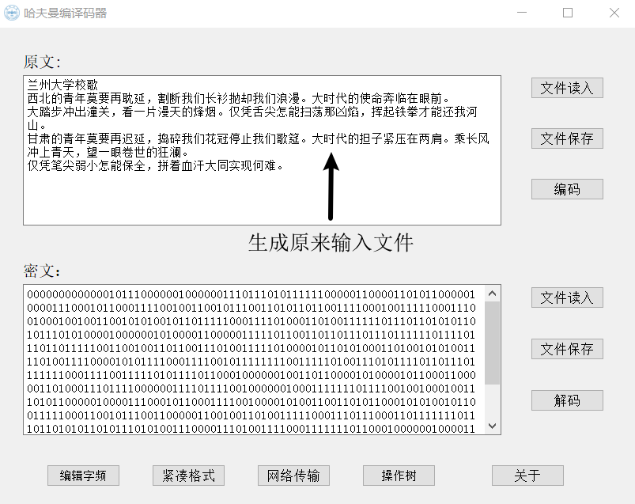
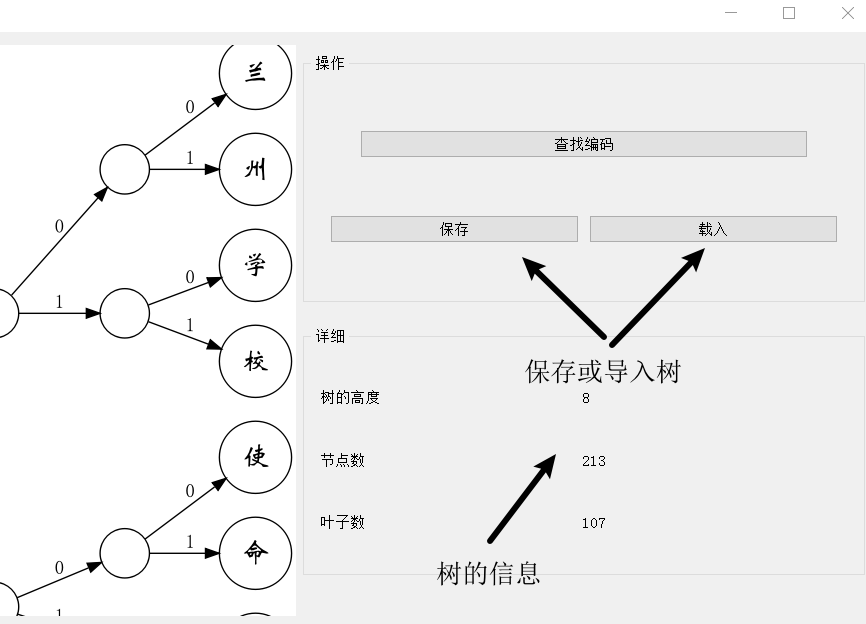
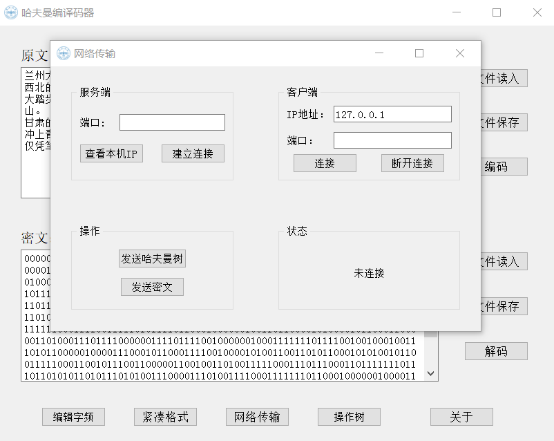
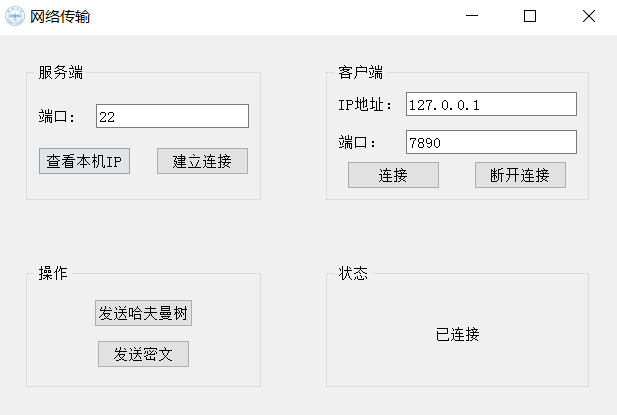
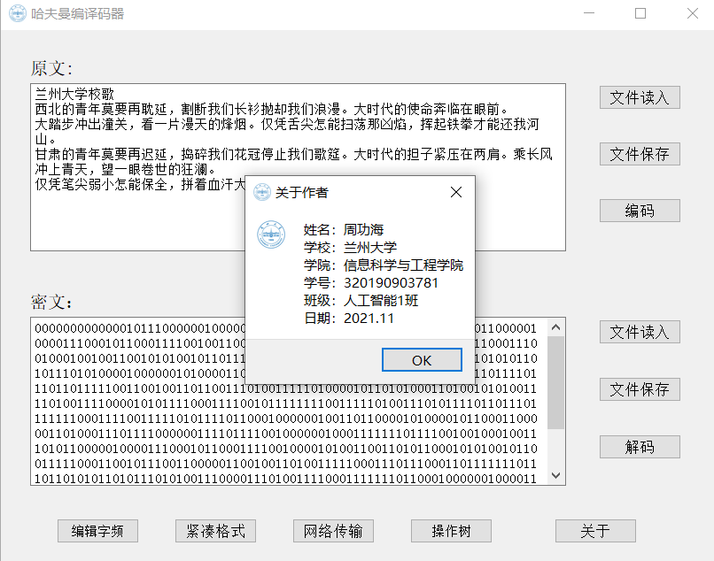

# Data-structure-Huffman-coding
# 大作业算法设计

## 哈夫曼编码问题

**问题描述:**打开一篇英文文章，统计该文章中每个字符出现的次数，然后以它们作为权值，对每一个字符进行编码，编码完成后再对其编码进行译码。

   利用哈夫曼编码进行信息通信可以大大提高信道利用率，缩短信息传输时间，降低传输成本。但是，这要求在发送端通过一个编码系统对待传数据预先编码，在接收端将传来的数据进行译码（复原）。对于双工信道（即可以双向传输信息的信道），每端都需要一个完整的编译码系统。试为这样的信息收发站写一个哈夫曼编译码系统。
一个完整的系统应具有以下功能：

（1） I ：初始化 (Initialization )。从终端读入字符集大小 n ，以及 n 个字符和 n 个权值，建立哈夫曼树，并将它存于文件 hfmTree 中。

（2） E ：编码 (Encoding )。利用已建好的哈夫曼树（如不在内存，则从文件 htmTree 中读入），对文件 ToBeTran 中的正文进行编码，然后将结果存入文件 CodeFile 中。

（3）D ：译码( Decoding )。利用已建好的哈夫曼树将文件 CodeFile 中的代码进行译码，结果存入文件 TextFile 中。

（4）P ：印代码文件( Print )。将文件 CodeFile 以紧凑格式显示在终端上，每行 50 个代码。同时将此字符形式的编码写入文件 CodePrint 中。

（5） T ：印哈夫曼树 (TreePrinting )。将已在内存中的哈夫曼树以直观的方式（树或凹入表形式）显示在终端上，同时将此字符形式的哈夫曼树写入文件 TreePrint 中。

**涉及知识点**： 哈夫曼树

## 问题解答

本题目大多数都是由C/C++实现的，而本人在自学python后发现用python处理本题目中的部分问题更为简易方便，因而本文多用python实现算法：

### 初始化（Initialization）

初始化有两种形式一种是直接根据原文生成，另一种是根据通过直接导入字符，而在这两种方法的基础上，还可对列表内的字符集进行增删改查，而对于现存的字符集还可进行保存文件这一操作，最终，在关闭该窗口时，程序会根据现有的字符集来进行建树。

#### 根据原文生成

```python
def add(self):
        # 加入一空行
        self.tableWidget.insertRow(self.tableWidget.rowCount())
    def generateCharacterSetFromRawtext(self):
        # 根据原文生成字符集
        self.tableWidget.clearContents()
        self.tableWidget.setRowCount(0)
        def getFrequency(text: str) -> dict:
            # 字频(统计)
            cnt = {}
            for i in text:
                if i not in cnt:
                    cnt[i] = 1
                else:
                    cnt[i] += 1
            return cnt
        CharacterSet = getFrequency(rawTextEdit.toPlainText())
        for i, j in CharacterSet.items():
            self.add()
            item1 = QTableWidgetItem(i)
            item2 = QTableWidgetItem(str(j))
            self.tableWidget.setItem(self.tableWidget.rowCount()-1, 0, item1)
            self.tableWidget.setItem(self.tableWidget.rowCount()-1, 1, item2)
```

#### 直接导入字符

```python
    def importWordFrequency(self):
        # 导入字频
        filePath, ok = QFileDialog.getOpenFileName(self, '选择文件')
        if ok:
            self.tableWidget.clearContents()
            self.tableWidget.setRowCount(0)
            with open(filePath, 'r', encoding='utf-8') as file:
                try:
                    frequency = file.read()
                except UnicodeDecodeError:
                    QMessageBox.critical(
                        self, "错误", "请确保打开的是UTF-8编码的文本文件", QMessageBox.OK)
                    return
            global CharacterSet
            CharacterSet = {}
            textlines = re.findall(r'([\s\S])\t(\S+)(\n|$)', frequency)
            if len(textlines) == 0:
                QMessageBox.critical(self, "错误", "字符集生成失败", QMessageBox.Ok)
                return
            for i, j, _ in textlines:
                try:
                    CharacterSet[i] = float(j)
                except ValueError:
                    QMessageBox.critical(
                        self, "错误", "字符集生成失败", QMessageBox.Ok)
                    self.tableWidget.clearContents()
                    self.tableWidget.setRowCount(0)
                    CharacterSet = {}
                    return
                self.add()
                item1 = QTableWidgetItem(i)
                item2 = QTableWidgetItem(j)
                self.tableWidget.setItem(
                    self.tableWidget.rowCount()-1, 0, item1)
                self.tableWidget.setItem(
                    self.tableWidget.rowCount()-1, 1, item2)
```
#### 额外的增删改查

```python

    def add(self):
        # 加入一空行
        self.tableWidget.insertRow(self.tableWidget.rowCount())

    def find(self):
        # 对于字符或字频或字符与字频进行查找
        a: str = self.wordFrequencyEdit.text()
        b: str = self.frequencyEdit.text()
        i: int = 0
        if a and b:
            while i < self.tableWidget.rowCount():
                if self.tableWidget.item(i, 0).text() == a and self.tableWidget.item(i, 1).text() == b:
                    self.resultLabel.setText(str(i+1))
                    break
                i += 1
        elif not a and b:
            while i < self.tableWidget.rowCount():
                if self.tableWidget.item(i, 1).text() == b:
                    self.resultLabel.setText(str(i+1))
                    break
                i += 1
        elif a and not b:
            while i < self.tableWidget.rowCount():
                if self.tableWidget.item(i, 0) and self.tableWidget.item(i, 0).text() == a:
                    self.resultLabel.setText(str(i+1))
                    break
                i += 1
        if i == self.tableWidget.rowCount():
            self.resultLabel.setText("未找到")


```

#### 保存字频

```python
    def saveWordFrequency(self):
        # 保存文件
        filePath, ok = QFileDialog.getSaveFileName(self, '选择文件')
        if ok:
            with open(filePath, 'w', encoding='utf-8') as file:
                for i in range(self.tableWidget.rowCount()):
                    m = '\t'.join([self.tableWidget.item(
                        i, 0).text(), self.tableWidget.item(i, 1).text()])
                    file.write(m+'\n')
```

#### 构建二叉树

```python
    def generateCharacterSetFromRawtext(self):
        # 根据原文生成字符集
        self.tableWidget.clearContents()
        self.tableWidget.setRowCount(0)
        def getFrequency(text: str) -> dict:
            # 字频(统计)
            cnt = {}
            for i in text:
                if i not in cnt:
                    cnt[i] = 1
                else:
                    cnt[i] += 1
            return cnt
        CharacterSet = getFrequency(rawTextEdit.toPlainText())
        for i, j in CharacterSet.items():
            self.add()
            item1 = QTableWidgetItem(i)
            item2 = QTableWidgetItem(str(j))
            self.tableWidget.setItem(self.tableWidget.rowCount()-1, 0, item1)
            self.tableWidget.setItem(self.tableWidget.rowCount()-1, 1, item2)

    def closeEvent(self, event):
        # 关闭窗体
        if self.tableWidget.rowCount() == 0:
            return
        global CharacterSet
        CharacterSet = {}
        # 将表格中的字符集存入变量CharacterSet中
        for i in range(self.tableWidget.rowCount()):
            if self.tableWidget.item(i, 0) and self.tableWidget.item(i, 1):
                try:
                    CharacterSet[self.tableWidget.item(i, 0).text()] = float(
                        self.tableWidget.item(i, 1).text())
                except:
                    pass
        global HFTree
        # 将树依据现有的字符集进行更新
        if CharacterSet != {}:
            HFTree = HuffmanTree(CharacterSet)
            global showSVGWidget
            if showSVGWidget:
                HFTree.printTree('tmp')
                showSVGWidget.update()
                paintTreeWindow.printInform()
```

### 编码（Encoding）

编码则是根据内存中现有的树来对原文进行编码，而原文的读取方式有两种，一种是手动输入，一种是读取文件，而原文也可进行保存。

#### 编码

```python
    def encode(self, text: str) -> str:
        # 对text中的文本进行编码
        p, q = '', ''  # p是每个字符的编码，q是整篇文章的编码
        for i in text:
            for j in self.nodes:
                if i == j.name:
                    while j.parent:
                        if j.parent.lchild == j:
                            p += '0'
                        elif j.parent.rchild == j:
                            p += '1'
                        j = j.parent
                    q += p[::-1]
                    p = ''
                    break
            else:
                # 若当前字符并不在字符集中，则返回空的密文
                return None
        return q
    def encoding(self):
        if not HFTree:
            QMessageBox.critical(self, "错误", "当前无建好的树", QMessageBox.Ok)
        elif rawTextEdit.toPlainText() == '':
            QMessageBox.critical(self, "错误", "请输入原文", QMessageBox.Ok)
        else:
            t = HFTree.encode(rawTextEdit.toPlainText())
            if not t:
                QMessageBox.critical(self, "错误", "存在无效字符", QMessageBox.Ok)
                return
            self.encodedTextEdit.setText(t)
```

#### 文件读入

```python
    def encodeFileReadin(self):
        filePath, ok = QFileDialog.getOpenFileName(self, '选择文件')
        if ok:
            with open(filePath, 'r', encoding='utf-8') as file:
                try:
                    text = file.read()
                except UnicodeDecodeError:
                    QMessageBox.critical(
                        self, "错误", "请确保打开的是UTF-8编码的文本文件", QMessageBox.Ok)
                    return
            self.rawTextEdit.setText(text)    
```
#### 保存原文

```python
def saveRawTextContent(self):
    filePath, ok = QFileDialog.getSaveFileName(self, '选择文件')
    if ok:
        with open(filePath, 'w', encoding='utf-8') as file:
            file.write(self.rawTextEdit.toPlainText())
```

### 译码（Decoding）

译码则是根据内存中现有的树来对密文进行译码，而密文的读取方式有两种，一种是手动输入，一种是读取文件，而密文也可进行保存

#### 译码（Decoding）

```python
def decode(self, text: str) -> str:
    # 在树中对text中的01串进行解码
    root: TreeNode = self.rootnode
    result = ""
    for i in text:
        if i == '0':
            root = root.lchild
        elif i == '1':
            root = root.rchild
        elif i == '\n':  # 紧凑格式中的'\n'需忽略
            continue
        else:
            return None
        if root.name:
            result += root.name
            root = self.rootnode
    if root != self.rootnode:
        return None
    else:
        return result
def decoding(self):
    if not HFTree:
        QMessageBox.critical(self, "错误", "当前无建好的树", QMessageBox.Ok)
    elif self.encodedTextEdit.toPlainText() == '':
        QMessageBox.critical(self, "错误", "请输入密文", QMessageBox.Ok)
    else:
        t = HFTree.decode(self.encodedTextEdit.toPlainText())
        if not t:
            QMessageBox.critical(self, "错误", "存在无效字符", QMessageBox.Ok)
            return
        self.rawTextEdit.setText(t)
```

#### 文件读入

```python
    def decodeFileReadin(self):
        filePath, ok = QFileDialog.getOpenFileName(self, '选择文件')
        if ok:
            with open(filePath, 'r', encoding='utf-8') as file:
                try:
                    encodedTextEdit = file.read()
                except UnicodeDecodeError:
                    QMessageBox.critical(
                        self, "错误", "请确保打开的是UTF-8编码的文本文件", QMessageBox.Ok)
                    return
            if not checkDecodedText(encodedTextEdit):
                QMessageBox.critical(self, "错误", "存在无效字符", QMessageBox.Ok)
                return
            self.encodedTextEdit.setText(encodedTextEdit)
③	保存密文
    def saveEncodedTextContent(self):
        if not checkDecodedText(self.encodedTextEdit.toPlainText()):
            QMessageBox.critical(self, "错误", "存在无效字符", QMessageBox.Ok)
            return
        filePath, ok = QFileDialog.getSaveFileName(self, '选择文件')
        if ok:
            with open(filePath, 'w', encoding='utf-8') as file:
                file.write(self.encodedTextEdit.toPlainText())
```

### 打印代码文件（Print）

此处我们要实现以紧凑格式输出，且要存储文件

#### 紧凑格式

```python
def compactFormPrint(self):
    Text = self.encodedTextEdit.toPlainText()
    text = ''
    m = 50
    for i in Text.replace('\n', ''):
        text += i
        m -= 1
        if m == 0:
            text += '\n'
            m = 50
    self.encodedTextEdit.setPlainText(text)
```

#### 存储

```python
def saveEncodedTextContent(self):
    if not checkDecodedText(self.encodedTextEdit.toPlainText()):
        QMessageBox.critical(self, "错误", "存在无效字符", QMessageBox.Ok)
        return
    filePath, ok = QFileDialog.getSaveFileName(self, '选择文件')
    if ok:
        with open(filePath, 'w', encoding='utf-8') as file:
            file.write(self.encodedTextEdit.toPlainText())
```

### 打印哈夫曼树（Tree printing）

打印哈夫曼树中，包括生成树的信息、对控件中的图像进行操作、树信息的显示以及树的导入以及存储，还有查看字符集的相关操作

#### 生成树的图片

```python
def printTree(self, filename=None):
    # 生成树的图片
    dot = Digraph(comment="生成的树")
    dot.attr('node', fontname="STXinwei", shape='circle', fontsize="20")
    for i, j in enumerate(self.nodes):
        if j.name == '' or not j.name:
            dot.node(str(i), '')
        elif j.name == ' ':
            dot.node(str(i), '[ ]')  # 空格显示为'[ ]'
        elif j.name == '\n':
            dot.node(str(i), '\\\\n')  # 换行符显示为'\n' 转义 此处的还会被调用，因此需要四个斜杠
        elif j.name == '\t':
            dot.node(str(i), '\\\\t')  # 制表符显示为'\t'
        else:
            dot.node(str(i), j.name)
    dot.attr('graph', rankdir='LR')
    for i in self.nodes[::-1]:
        if not (i.rchild or i.lchild):
            break
        if i.lchild:
            dot.edge(str(self.nodes.index(i)), str(
                self.nodes.index(i.lchild)), '0', constraint='true')
        if i.rchild:
            dot.edge(str(self.nodes.index(i)), str(
                self.nodes.index(i.rchild)), '1', constraint='true')
    dot.render(filename, view=False, format='svg')
```

#### 树图像的放大缩小

```python
class ShowSVGWidget(QWidget):
    # 自定义控件，显示svg图片
    leftClick: bool
    svgrender: QSvgRenderer
    defaultSize: QSizeF
    point: QPoint
    scale = 1

    def __init__(self, parent=None):
        super().__init__(parent)
        self.parent = parent
        # 构造一张空白的svg图像
        self.svgrender = QSvgRenderer(
            b'<svg xmlns="http://www.w3.org/2000/svg" viewBox="0 0 0 0"  width="512pt" height="512pt"></svg>')
        # 获取图片默认大小
        self.defaultSize = QSizeF(self.svgrender.defaultSize())
        self.point = QPoint(0, 0)
        self.scale = 1

    def update(self):
        # 更新图片
        self.svgrender = QSvgRenderer("tmp.svg")
        self.defaultSize = QSizeF(self.svgrender.defaultSize())
        self.point = QPoint(0, 0)
        self.scale = 1
        self.repaint()

    def paintEvent(self, a0: QtGui.QPaintEvent) -> None:
        # 绘画事件(回调函数)
        painter = QPainter()  # 画笔
        painter.begin(self)
        self.svgrender.render(painter, QRectF(
            self.point, self.defaultSize*self.scale))  # svg渲染器来进行绘画，(画笔，QRectF(位置，大小))(F表示float)
        painter.end()

    def mouseMoveEvent(self, a0: QtGui.QMouseEvent) -> None:
        # 鼠标移动事件(回调函数)
        if self.leftClick:
            self.endPos = a0.pos()-self.startPos
            self.point += self.endPos
            self.startPos = a0.pos()
            self.repaint()

    def mousePressEvent(self, a0: QtGui.QMouseEvent) -> None:
        # 鼠标点击事件(回调函数)
        if a0.button() == Qt.LeftButton:
            self.leftClick = True
            self.startPos = a0.pos()

    def mouseReleaseEvent(self, a0: QtGui.QMouseEvent) -> None:
        # 鼠标释放事件(回调函数)
        if a0.button() == Qt.LeftButton:
            self.leftClick = False

    def wheelEvent(self, a0: QtGui.QWheelEvent) -> None:
        # 根据光标所在位置进行图像缩放
        oldScale = self.scale
        if a0.angleDelta().y() > 0:
            # 放大
            if self.scale <= 5.0:
                self.scale *= 1.1
        elif a0.angleDelta().y() < 0:
            # 缩小
            if self.scale >= 0.2:
                self.scale *= 0.9
        self.point = a0.pos()-(self.scale/oldScale*(a0.pos()-self.point))
        self.repaint()
```

#### 树信息的显示

```python
def printInform(self):
    # 更新树的信息
    self.treeHeightlabel.setText(str(self.TreeDepth(HFTree)))
    self.nodeCountlabel.setText(str(len(HFTree.characterset)*2-1))
    self.leafCountlabel.setText(str(len(HFTree.characterset)))
```

#### 树文件的读取

```python
def importtree(self):
    # 将树的信息导入到图片中
    filePath, ok = QFileDialog.getOpenFileName(self, '选择文件')
    if ok:
        with open(filePath, 'r', encoding='utf-8') as file:
            try:
                text = file.read()
            except UnicodeDecodeError:
                QMessageBox.critical(
                    self, "错误", "请确保打开的是UTF-8编码的文本文件", QMessageBox.Ok)
                return
        global CharacterSet
        CharacterSet = self.CharacterSet
        textlines = re.findall(r'([\s\S])\t(\S+)\t\S+(\n|$)', text)
        # 导入后重置字符集信息，并更新内存中的树
        for i, j, _ in textlines:
            CharacterSet[i] = float(j)
        global HFTree
        if CharacterSet != {}:
            HFTree = HuffmanTree(CharacterSet)
            global showSVGWidget
            HFTree.printTree('tmp')
            showSVGWidget.update()
            self.printInform()  # 将树的信息写在面板上
```

#### 树的存储

```python
def savetree(self):
    # 保存树的信息
    filePath, ok = QFileDialog.getSaveFileName(self, '选择文件')
    if ok:
        with open(filePath, 'w', encoding='utf-8') as file:
            for i, j in HFTree.characterset.items():
                m = '\t'.join([i, str(j), HFTree.encode(i)])
                file.write(m+'\n')
```

### 网络通信（Network）

网络通信包括服务端监听接口以及等待连接、客户端建立连接、树和密文的传输、等待接收以及断开连接

#### 服务端监听端口

```python
def buildServerConnection(self):
    # 服务端监听端口
    try:
        # 获取端口号
        port = int(self.lineEdit.text())
    except ValueError:
        QMessageBox.critical(self, "错误", "当前无已输入的端口号", QMessageBox.Ok)
        return
    # 建立一个套接字
    s = socket.socket(socket.AF_INET, socket.SOCK_STREAM)
    try:
        # 设置监听端口并监听
        s.bind(("0.0.0.0", port))
        s.listen()
    except OSError:
        QMessageBox.critical(self, "错误", "端口已被占用", QMessageBox.Ok)
        return
    # 等待客户端连接
    self.stateLabel.setText("等待连接")
    # 开启一个新的线程用于等待连接，防止程序阻塞，并利用daemon标记，以便于主线程结束时，自动结束带有此标记的所有线程
    threading.Thread(target=self.handleClient,
                     args=[s], daemon=True).start()
```

#### 服务端等待连接

```python
def handleClient(self, s: socket.socket):
    # 服务器端等待连接
    c = s.accept()[0]
    self.stateLabel.setText("已连接")
    self.s = c
    # 启动等待接收的线程
    threading.Thread(target=self.waitRecv, args=[c], daemon=True).start()
```

#### 客户端建立连接

```python
def buildClientConnection(self):
    # 客户端建立连接
    try:
        # 获取IP地址
        ip = self.connectIpEditText.text()
        if ip == None:
            QMessageBox.critical(
                self, "错误", "当前无已输入的IP地址", QMessageBox.Ok)
            return
        port = int(self.connectPortEditText.text())
    except ValueError:
        QMessageBox.critical(self, "错误", "当前无已输入的端口号", QMessageBox.Ok)
        return
    s = socket.socket(socket.AF_INET, socket.SOCK_STREAM)
    try:
        s.connect((ip, port))
    except ConnectionRefusedError:
        QMessageBox.critical(self, "错误", "连接失败", QMessageBox.Ok)
        return
    except OSError:
        QMessageBox.critical(self, "错误", "IP或端口错误", QMessageBox.Ok)
        return
    self.stateLabel.setText("已连接")
    self.s = s
    # 连接成功，启动等待接收的线程
    threading.Thread(target=self.waitRecv, args=[s], daemon=True).start()
```

#### 树和密文的传输

```python
def sendTree(self):
    # 发送树
    if not self.s:
        QMessageBox.critical(self, "错误", "请先建立连接", QMessageBox.Ok)
        return
    global CharacterSet
    if not CharacterSet or not HFTree:
        QMessageBox.critical(self, "错误", "当前树为空", QMessageBox.Ok)
        return
    content = 't'  # 发送树的标志
    for i, j in CharacterSet.items():
        content += i+"\t"+str(j)+'\n'
    # 将其转化为Byte进行发送
    self.s.sendall(content.encode())
    QMessageBox.information(self, "提示", "发送成功", QMessageBox.Ok)

def sendText(self):
    # 发送密文
    if not self.s:
        QMessageBox.critical(self, "错误", "请先建立连接", QMessageBox.Ok)
        return
    global encodedTextEdit
    content = encodedTextEdit.toPlainText()
    if not checkDecodedText(content):
        QMessageBox.critical(self, "错误", "存在无效字符", QMessageBox.Ok)
        return
    self.s.sendall(('c'+content).encode())
    QMessageBox.information(self, "提示", "发送成功", QMessageBox.Ok)
```

#### 等待连接

```python
def waitRecv(self, s: socket.socket):
    # 等待接受线程
    try:
        while True:
            data = s.recv(10000000)
            # 将内容转变为str类型
            data = data.decode()
            if data[0] == 't':
                data = data[1:]
                textlines = re.findall(r'([\s\S])\t(\S+)(\n|$)', data)
                global CharacterSet
                CharacterSet = {}
                for i, j, _ in textlines:
                    try:
                        CharacterSet[i] = float(j)
                    except ValueError:
                        self.stateLabel.setText("接收到无用数据")
                        self.tableWidget.clearContents()
                        self.tableWidget.setRowCount(0)
                        CharacterSet = {}
                        return
                global HFTree
                if CharacterSet != {}:
                    HFTree = HuffmanTree(CharacterSet)
                    self.stateLabel.setText("已收到树")
                else:
                    self.stateLabel.setText("收到空树")
            elif data[0] == 'c':
                self.stateLabel.setText("已收到密文")
                data = data[1:]
                self.setEncodedTextSign.emit(data)
            else:
                self.stateLabel.setText("接收到无用数据")
    except ConnectionResetError:  # 对方断开
        self.stateLabel.setText("连接断开")
        self.s = None
    except ConnectionAbortedError:  # 自己断开
        pass
```

#### 断开连接

```python
def breakConnection(self):
    # 断开连接按钮事件
    try:
        self.s.close()
        self.s = None
        self.stateLabel.setText("未连接")
    except:
        pass   
```
## 项目成果功能展示：

​     本章主要对本软件的设计细节和实测性能进行详细的介绍，能够让读者更为深入地理解 每个步骤的意义以及实现原理。

### 初始化（Initialization）

初始化有两种形式一种是直接根据文本框输入生成，另一种是根据通过直接导入字符，而在这两种方法的基础上，还可对列表内的字符集进行增删改查，而对于现存的字符集还可进行保存文件这一操作，最终，在关闭该窗口时，程序会根据现有的字符集来进行建树。

#### 文本输入

文本的输入主要有两种途径，一种是直接根据文本框输入生成，另一种是根据通过直接导入字符。这两种输入途径没有十分明显的区别，直接导入文本的时候最终文本还是会直接显示在文本框界面中。如图二、文本初始化所示：

<center>
    
    <br>
    <div style="color:orange; border-bottom: 1px solid #d9d9d9;
    display: inline-block;
    color: #000;
    padding: 2px;">图1.文本初始化</div>
</center>


#### 额外的增删改查

在将文本输入或导入“原文：”的文本框后，还提供有随时修改文本功能。即可以在编码之前我们可以随时调整文本框内的内容，保证我们发送内容的准确性。

#### 构建二叉树

在输入文本后点击编辑字频之后会弹出如图三的UI框，本程序提供自动生成字频功能、字频导入以及字频保存功能，依然提供两种方式实现字频的输入以方便用户的日常使用，使用户使用效率最大化。

<center>
    
    <br>
    <div style="color:orange; border-bottom: 1px solid #d9d9d9;
    display: inline-block;
    color: #000;
    padding: 2px;">图2、编辑字频</div>
</center>
 

​     在字频统计好之后程序会根据每个字字频大小确定其权重大小，为之后的编码操作奠定基础。

#### 保存字频

如上图三所示，如果文本内容较多，为了避免每次都需要自动生成字符集，这样可能会花费较多的时间，我们提供了字频保存的功能，方便提高效率。我们可以在不同环境、不同电脑上直接对保存字频生成的二叉树进行操作。

### 编码（Encoding）

#### 编码

如图四、编码过程所示，点击编码后会将之前的字频所确定的各个字的节点生成一棵哈夫曼树（Huffmantree），之后将生成的哈夫曼树依次遍历编码即可完成对所输入内容的哈夫曼编码，生成密文。

<center>
    
    <br>
    <div style="color:orange; border-bottom: 1px solid #d9d9d9;
    display: inline-block;
    color: #000;
    padding: 2px;">图3、编码过程</div>
</center>

#### 保存原文

此处提供保存密文的功能，方便之后数据传输及记录。

### 译码（Decoding）

#### 密文导入

如下图五、密文导入所示，我们在接收到别人通过网络传输发送的哈夫曼密文时，可以将密文复制进文本框中，或者选择直接导入密文

<center>
    
    <br>
    <div style="color:orange; border-bottom: 1px solid #d9d9d9;
    display: inline-block;
    color: #000;
    padding: 2px;">图4、密文导入</div>
</center>


####  译码

点击译码时，循环读入一串哈夫曼序列，读到“0”从根结点的左孩子继续读，读到“1”从右孩子继续，如果读到一个结点的左孩子和右孩子是否都为0，如果是说明已经读到了一个叶子（字符），翻译一个字符成功，把该叶子结点代表的字符存在一个存储翻译字符的数组中，然后继续从根结点开始读，直到读完这串哈夫曼序列，遇到结束符便退出循环。

之后将生成的字符打印在“原文：”文本框里。实现将文本译码的功能。

<center>
    
    <br>
    <div style="color:orange; border-bottom: 1px solid #d9d9d9;
    display: inline-block;
    color: #000;
    padding: 2px;">图5、译码输出</div>
</center>


#### 文件读入和保存

可以将译码的文字内容通过“文件保存”存储到本地。

### 打印哈夫曼树

####  生成树的图片及存储

点击操作树，会生成如图所示的文本图片（其展示的树的图像不完全），可以“保存”和“载入”按钮进行树的存储或者导入功能。此树具备放大缩小展示的特性（缩小后不方便看清楚树的细节），在其界面角落还保留有对树的信息进行统计展示的功能。其内容主要包括树的高度，节点数以及叶子数等，本文案例中展示的“树的高度为8，树的节点数为213，树的叶子数为107”

除此以外，还提供有查找编码的功能，其主要是通过查询字符内容可以确定其字频数目，进而可以确定该字符的权重，可以反推出该字符在哈夫曼树中的位置。

如果对生成的哈夫曼树不满意，该程序还提供有对哈夫曼树中相关节点删除或者插入的功能，只要在“编辑字频”界面输入字符以及其字频（即权重），点击“插入”或“删除”按钮就可以完成对哈夫曼树的插入或删除操作。该功能对于我们需要紧急处理一些突发情况，例如在自动生成字频时发生错误，我们便可以利用此项功能对树，进而对编码实现修改。

<center>
    
    <br>
    <div style="color:orange; border-bottom: 1px solid #d9d9d9;
    display: inline-block;
    color: #000;
    padding: 2px;">图6、生成图的图片及存储</div>
</center>


### 网络通信

<center>
    
    <br>
    <div style="color:orange; border-bottom: 1px solid #d9d9d9;
    display: inline-block;
    color: #000;
    padding: 2px;">图7、网络通信</div>
</center>

如图八所示，本程序提供查询本机IP地址功能，可以开放本机端口作为哈夫曼编码的传输端口，连接好客户端的IP及接收端口后可以将本机的哈夫曼树和密文一起发送到客户端上，客户端可以导入哈夫曼树后运行解码操作就可以实现将文本转化的操作。
<center>
    
    <br>
    <div style="color:orange; border-bottom: 1px solid #d9d9d9;
    display: inline-block;
    color: #000;
    padding: 2px;">图8、网络传输哈夫曼树及密文</div>
</center>

## 4.7 关于界面

<center>
    
    <br>
    <div style="color:orange; border-bottom: 1px solid #d9d9d9;
    display: inline-block;
    color: #000;
    padding: 2px;">图9、关于作者</div>
</center> 

由上图所示，在关于界面集中展示了我本人的相关信息，例如：姓名，学校，学院，学号，班级以及完成该作品的时间等。
